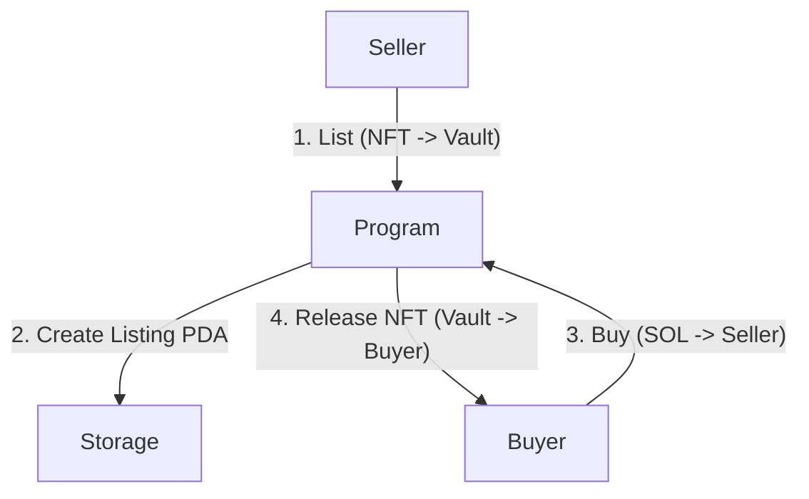

# 🛒 Solana NFT Marketplace (Escrow)

A decentralized, trustless NFT marketplace built on the Solana blockchain using the **Anchor Framework**. This program implements a **True Escrow** mechanism where the program takes custody of the NFT during the listing period to ensure safety for both buyers and sellers.

  

## 📖 User Stories

The application is designed around two core user flows:

### 👤 The Seller
> **"As a Seller, I want to list my NFT for a specific price so that I can sell it securely without manual intervention."**
* **Action:** Seller calls `list_nft`.
* **Result:** The NFT is transferred from the Seller's wallet to a **Program Vault (PDA)**. A `Listing` account is created to store the price and seller data.
* **Security:** The Seller cannot "double spend" or move the NFT while it is listed.

### 👤 The Buyer
> **"As a Buyer, I want to purchase a listed NFT by paying the exact price so that I receive the asset immediately."**
* **Action:** Buyer calls `buy_nft`.
* **Result:** The program verifies the payment amount. It atomically transfers **SOL** to the Seller and the **NFT** (from the Vault) to the Buyer.
* **Security:** The trade is atomic; the Buyer is guaranteed to receive the NFT if the SOL transfer succeeds.

---

## 🏗️ Technical Architecture

This program uses **Program Derived Addresses (PDAs)** to manage state and custody assets.

* **Listing Account (`listing`):** Stores the price, seller's public key, and active status.
* **Vault Account (`vault`):** An SPL Token Account owned by the Program (PDA) that holds the NFT in escrow.

### Flow Diagram



---

## 🚀 Getting Started

### Prerequisites
* **Rust & Cargo**: Latest stable version.
* **Solana CLI**: v1.18+
* **Anchor**: v0.32+
* **Yarn/Node.js**: For running tests.

### 1. Clone & Install
```bash
git clone <your-repo-url>
cd nft_marketplace1
yarn install
```

### 2. Build the Program
This compiles the Rust code and generates the IDL.
```bash
anchor build
```

### 3. Run Tests (Localnet)
The recommended way to test is using the local validator for speed and stability.

**Option A: Automated (Spin up validator automatically)**
```bash
anchor test
```

**Option B: Manual (If you want to keep the validator running)**
1.  Open a new terminal and run:
    ```bash
    solana-test-validator
    ```
2.  In your project terminal, deploy and run tests:
    ```bash
    anchor test --skip-local-validator
    ```

---

## 📂 Project Structure

```text
.
├── programs
│   └── nft_marketplace1
│       ├── src
│       │   ├── lib.rs              # Entry point (Router)
│       │   ├── instructions        # Business Logic
│       │   │   ├── mod.rs          # Export modules
│       │   │   ├── list_nft.rs     # Escrow listing logic
│       │   │   └── buy_nft.rs      # Atomic swap logic
│       │   └── state
│       │       ├── mod.rs
│       │       └── listing.rs      # Listing struct definition
│       └── Cargo.toml
├── tests
│   └── nft_marketplace1.ts         # TypeScript Integration Tests
└── Anchor.toml                     # Configuration
```

## 🛠️ Key Instructions

### `list_nft`
* Initializes the `Listing` PDA.
* Initializes the `Vault` token account.
* Transfers the NFT from the Seller to the `Vault`.

### `buy_nft`
* Verifies the `price` matches the listing.
* Transfers **SOL** from Buyer → Seller.
* Signer (PDA) transfers **NFT** from Vault → Buyer.
* Closes the listing (sets `is_active = false`).

---

## ✅ Testing Coverage

The included test suite (`tests/nft_marketplace1.ts`) covers the complete lifecycle:
1.  **Setup:** Creates a new Mint (NFT) and funds test wallets.
2.  **Listing:** Verifies the NFT moves out of the seller's wallet and into the Vault.
3.  **Buying:** Verifies the NFT moves to the buyer and SOL moves to the seller.

**Run tests with:**
```bash
anchor test
```
