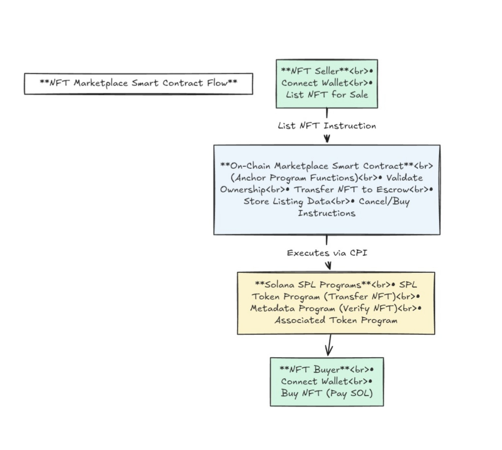

# 🖼️ Solana NFT Marketplace (Anchor)


> A fully on-chain NFT listing & escrow marketplace built using **Solana** + **Anchor**.

This program allows users to list NFTs, cancel listings, and purchase NFTs securely using a PDA-based escrow system. All logic is strictly on-chain, ensuring a trustless environment.

---

## 📐 Architecture


### System Design
The following diagram illustrates the relationship between the Seller, Buyer, and the Program PDAs.


### Core Components

| **PDA Account** | **Purpose** |
| :--- | :--- |
| `listing` | Stores listing metadata: price, seller pubkey, NFT mint, status. |
| `escrow_auth` | A PDA authority that "signs" for the escrow token account. |
| `nft_escrow` | The actual Token Account holding the NFT during the sale. |

---

## 🚀 Features

- **🧾 List NFT for Sale:** Seller locks their NFT in a program-controlled PDA escrow.
- **💰 Buy NFT:** Buyer pays SOL and atomically receives the NFT from escrow.
- **❌ Cancel Listing:** Seller can cancel the listing and retrieve the NFT if not yet sold.
- **🔐 Fully On-Chain:** No centralized backend required.
- **🛡️ Secure Escrow:** Uses PDAs (Program Derived Addresses) to prevent unauthorized withdrawals.

---

## 🏗️ Project Structure

```bash
programs/
└── nft_marketplace/
    ├── src/
    │   ├── lib.rs              # Entry point & instruction routing
    │   ├── errors.rs           # Custom program errors
    │   ├── state/
    │   │   └── listing.rs      # Account structs (Listing data)
    │   └── instructions/
    │       ├── list_nft.rs     # Logic: Transfer NFT to Escrow
    │       ├── buy_nft.rs      # Logic: Transfer SOL to Seller, NFT to Buyer
    │       └── cancel_listing.rs # Logic: Return NFT to Seller
    └── Cargo.toml
````

-----

## 🛠️ Getting Started

### Prerequisites

Ensure you have the following installed:

  * **Solana CLI** v1.16+
  * **Anchor** v0.30+
  * **Rust** (stable)
  * **Node.js** (v18+ recommended)

### Installation & Build

1.  **Clone the repo:**

    ```bash
    git clone [https://github.com/Harshbhargav45/nft_marketplace.git](https://github.com/Harshbhargav45/nft_marketplace.git)
    cd nft_marketplace
    ```

2.  **Install dependencies:**

    ```bash
    yarn install
    ```

3.  **Build the program:**

    ```bash
    anchor build
    ```

4.  **Test the program:**

    ```bash
    anchor test
    ```

-----

## 🔗 Client Usage (TypeScript)

Below are examples of how to interact with the program using the Anchor TS client.

### 1\. List an NFT

Transfers the NFT from the seller to the escrow PDA.

```typescript
await program.methods
  .listNft(new BN(price_in_lamports))
  .accounts({
     seller: seller.publicKey,
     sellerNftAccount: sellerTokenAccount,
     mint: nftMintAddress,
     listing: listingPda,
     escrowAuth: escrowAuthPda,
     nftEscrowAccount: escrowTokenAccount,
     tokenProgram: TOKEN_PROGRAM_ID,
     systemProgram: SystemProgram.programId,
  })
  .rpc();
```

### 2\. Buy an NFT

Transfers SOL from buyer to seller, and NFT from escrow to buyer.

```typescript
await program.methods
  .buyNft()
  .accounts({
     buyer: buyer.publicKey,
     buyerNftAccount: buyerTokenAccount,
     listing: listingPda,
     escrowAuth: escrowAuthPda,
     nftEscrowAccount: escrowTokenAccount,
     seller: seller.publicKey, // Receives the SOL
     tokenProgram: TOKEN_PROGRAM_ID,
     systemProgram: SystemProgram.programId,
  })
  .rpc();
```

### 3\. Cancel Listing

Returns the NFT to the seller.

```typescript
await program.methods
  .cancelListing()
  .accounts({
     seller: seller.publicKey,
     listing: listingPda,
     escrowAuth: escrowAuthPda,
     nftEscrowAccount: escrowTokenAccount,
     sellerNft: sellerTokenAccount,
     tokenProgram: TOKEN_PROGRAM_ID,
  })
  .rpc();
```

-----

## 🛡️ Security Assurance

  * **Atomic Transactions:** The buy instruction ensures that SOL and the NFT are swapped in the same transaction. If one fails, the whole transaction fails.
  * **PDA Ownership:** Only the `escrow_auth` PDA can authorize the movement of the NFT, preventing external hacks.
  * **Constraint Checks:** Anchor constraints (`has_one`, `seeds`, `mut`) are utilized to strictly validate all accounts passed to the program.

-----

## 🔮 Roadmap

  - [ ] **Royalties:** Integrate Metaplex standards to enforce creator royalties.
  - [ ] **Auctions:** Add bidding mechanisms.
  - [ ] **Floor Index:** Add analytics for floor prices.

-----

## 🤝 Contributing

Contributions are welcome\! Please open an issue or submit a pull request.


```
